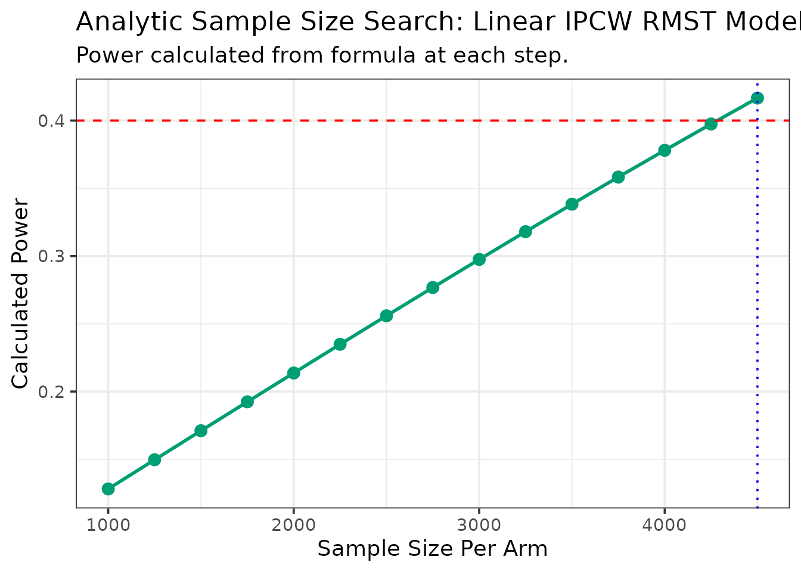

# RMSTpowerBoost: Sample Size and Power Calculations for RMST-based Clinical Trials

## Introduction

The design and analysis of clinical trials with time-to-event endpoints
often rely on the hazard-based model (e.g., the PH model) and use the
hazard ratio (HR) as the primary estimand of the treatment effect.
However, the HR can be challenging to interpret from both clinical and
causal perspectives. Moreover, the key assumption underlying most
hazards models - the proportional hazards assumption - is often tenuous
or violated in real-world settings.

As an alternative, the **Restricted Mean Survival Time (RMST)** is
gaining favor for its straightforward interpretation and robust
properties ([Royston and Parmar 2013](#ref-royston2013); [Uno et al.
2014](#ref-uno2014)). The RMST measures the average event-free time up
to a pre-specified follow-up point, $L$. This provides a direct and
meaningful measure of treatment benefit (e.g., “an average of 3 extra
months of survival over 5 years”), which is highly valuable for
clinicians and patients.

Modern statistical methods now focus on modeling the RMST directly as a
function of baseline covariates, rather than estimating it indirectly
from a survival curve or a hazard function. This direct approach, based
on foundational work using Inverse Probability of Censoring Weighting
(IPCW) ([Tian, Zhao, and Wei 2014](#ref-tian2014)), has been extended to
handle the complex data structures observed in modern trials, including
facility profiling in multi-center studies or other stratification
factors ([Wang et al. 2019](#ref-wang2019); [Zhang and Schaubel
2024](#ref-zhang2024)) and covariate-dependent censoring ([Wang and
Schaubel 2018](#ref-wang2018)).

However, most software tools for these advanced methods focus on
analyzing existing data, not designing new studies. This has left trial
statisticians to write custom code for the crucial task of calculating
sample size and power.

The `RMSTpowerBoost` package is designed to fill this gap. It provides a
comprehensive and user-friendly suite of tools for **power and sample
size calculations** based on the latest direct RMST methodologies. The
package implements several key approaches from the statistical
literature:

- **Generalized Linear Models**: The foundational regression model for
  RMST with IPCW-based estimation ([Tian, Zhao, and Wei
  2014](#ref-tian2014)).
- **Stratified Models**: Efficient methods for studies with a large
  number of strata (e.g., clinical centers), including both **additive**
  ([Zhang and Schaubel 2024](#ref-zhang2024)) and **multiplicative**
  ([Wang et al. 2019](#ref-wang2019)) models.
- **Dependent Censoring Models**: Methods for handling
  covariate-dependent censoring ([Wang and Schaubel
  2018](#ref-wang2018)).
- **Flexible Non-Linear Models**: Bootstrap-based functions using
  Generalized Additive Models (GAMs) to capture non-linear covariate
  effects.
- **Analytic vs. Bootstrap Methods**: For most models, the package
  offers a choice between a fast `analytical` calculation and a robust,
  simulation-based `boot` method.

This vignette will guide you through the theory and application of each
of these function groups.

------------------------------------------------------------------------

## Core Concepts of `RMSTpowerBoost` Package

The functions in this package are grounded in a regression‐based
formulation of the **restricted mean survival time (RMST)**. For a given
subject $i$ with event time $T_{i}$, covariate vector $Z_{i}$ and
treatment indicator ${Trt}_{i}$, the conditional RMST is modeled as

$${\mathbb{E}}\left\lbrack \min\left( T_{i},L \right) \mid Z_{i} \right\rbrack\; = \;\beta_{0} + \beta_{\text{effect}}\,{Trt}_{i} + \beta_{2}^{\top}Z_{i},$$

where $L$ is the restriction time, and $\beta_{\text{effect}}$
represents the average treatment effect on the RMST scale—essentially,
the expected gain in event‐free time attributable to treatment. The
quantity $\beta_{\text{effect}}$ therefore defines the **effect size**.
All analytical power and sample size functions in `RMSTpowerBoost` use
this parameterization as their foundation.

### The Analytic Method (`.analytical` functions)

The analytical functions are extremely fast because they use a direct
mathematical formula to calculate power. This makes them ideal for
quickly exploring different scenarios. The process is:

1.  **One-Time Estimation**: The function first analyzes the provided
    `pilot_data` to estimate two key parameters:
    - The **treatment effect size** (e.g., the difference in RMST or the
      log-RMST ratio).
    - The **asymptotic variance** of that effect estimator, which
      measures its uncertainty.
2.  **Power Formula**: It then plugs these fixed estimates into a
    standard power formula. For a given total sample size `N`, the power
    is calculated as:
    $$\text{Power} = \Phi\left( \frac{\left| \beta_{\text{effect}} \right|}{\sigma_{N}} - z_{1 - \alpha/2} \right)$$
    where:
    - $\Phi$ is the cumulative distribution function (CDF) of the
      standard normal distribution.
    - $\beta_{\text{effect}}$ is the treatment effect.
    - $\sigma_{N} = \frac{\sigma_{1}}{\sqrt{N}}$ is the standard error
      of the effect for the target sample size `N`, which is scaled from
      the pilot data’s variance.
    - $z_{1 - \alpha/2}$ is the critical value from the standard normal
      distribution (e.g., 1.96 for an alpha of 0.05).

### The Bootstrap Method (`.boot` functions)

The bootstrap functions provide a robust, simulation-based alternative
that makes fewer assumptions about the data’s distribution. This is a
trade-off, as they are much more computationally intensive. The process
is:

1.  **Resample**: The function simulates a “future trial” of a given
    `sample_size` by resampling with replacement from the `pilot_data`.
2.  **Fit Model**: On this new bootstrap sample, it performs the full
    analysis (e.g., calculating weights or pseudo-observations and
    fitting the specified model).
3.  **Get P-Value**: It extracts the p-value for the treatment effect
    from the fitted model.
4.  **Repeat**: This process is repeated thousands of times (`n_sim`).
5.  **Calculate Power**: The final estimated power is the proportion of
    simulations where the p-value was less than the significance level
    `alpha`.
    $$\text{Power} = \frac{{\text{Number of simulations with}\mspace{6mu}}p < \alpha}{n_{\text{sim}}}$$

### The Sample Size Search Algorithm (`.ss` functions)

All functions ending in `.ss` (for sample size) use the same iterative
search algorithm to find the `N` required to achieve a `target_power`:

1.  **Start**: The search begins with a sample size of `n_start`.
2.  **Calculate Power**: It calculates the power for the `current_n`
    using either the **analytic formula** or a **full bootstrap
    simulation**.
3.  **Check Condition**:
    - If `calculated_power >= target_power`, the search succeeds and
      returns `current_n`.
    - If not, it increments the sample size
      (`current_n = current_n + n_step`) and repeats the process.
4.  **Stopping Rules**: The search terminates if the sample size exceeds
    `max_n_per_arm` or, for bootstrap methods, if the power fails to
    improve for a set number of `patience` steps.

### Avaailable Functions: A Quick Guide

The package uses a consistent naming convention to help you select the
correct function. The names are combinations of the `[Model Type]`, the
`[Goal - power or ss]`, and the `[Method - analytical or boot]`. The
table below provides a summary of the available functions for each
model.

[TABLE]

### Selecting an Appropriate Model

Model selection depends on the assumptions made about the data structure
and the design of the study. The following table summarizes recommended
modeling strategies under various analytical scenarios:

| Model                         | Key Assumption / Scenario                                                    | Recommended Use Case                                                                                                                                           |
|:------------------------------|:-----------------------------------------------------------------------------|:---------------------------------------------------------------------------------------------------------------------------------------------------------------|
| **Linear IPCW**               | Assumes a linear relationship between covariates and RMST.                   | Suitable for baseline analyses where there is no strong evidence of non-linear effects or complex stratification.                                              |
| **Additive Stratified**       | Assumes the treatment adds a constant amount of survival time across strata. | Appropriate for multi-center trials where the treatment effect is expected to be uniform (e.g., a fixed increase in survival time across centers).             |
| **Multiplicative Stratified** | Assumes the treatment multiplies survival time proportionally across strata. | Preferred in multi-center trials where the treatment is expected to produce proportional gains relative to baseline survival across different centers.         |
| **Semiparametric GAM**        | Allows for non-linear covariate effects on RMST.                             | Useful when variables (e.g., age, biomarker levels) are believed to have complex, non-linear associations with the outcome.                                    |
| **Dependent Censoring**       | Accounts for dependent censoring or competing risks.                         | Recommended for studies involving competing events, such as transplant studies where receiving a transplant precludes observation of pre-transplant mortality. |

## Linear IPCW Models

These functions implement the foundational direct linear regression
model for the RMST. This model is appropriate when a linear relationship
between covariates and the RMST is assumed, and when censoring is
independent of the event of interest.

### Theory and Model

Based on the methods of ([Tian, Zhao, and Wei 2014](#ref-tian2014)),
these functions model the conditional RMST as a linear function of
covariates:
$${\mathbb{E}}\left\lbrack \min\left( T_{i},L \right)|Z_{i} \right\rbrack = \beta_{0} + \beta_{\text{effect}}\text{Treatment}_{i} + \beta_{2}\text{Covariate}_{i}$$
In this model, the expected RMST up to a pre-specified time **L** for
subject *i* is modeled as a linear combination of their treatment arm
and other variables $Z_{i}$.

To handle right-censoring, the method uses **Inverse Probability of
Censoring Weighting (IPCW)**. This is achieved through the following
steps:

1.  A survival curve for the **censoring distribution** is estimated
    using the Kaplan-Meier method (where “failure” is being censored).
2.  For each subject who experienced the primary event, a weight is
    calculated. This weight is the inverse of the probability of *not*
    being censored up to their event time.
3.  A standard weighted linear model
    ([`lm()`](https://rdrr.io/r/stats/lm.html)) is then fitted using
    these weights. The model only includes subjects who experienced the
    event.

### Analytical Methods

The analytical functions use a formula based on the asymptotic variance
of the regression coefficients to calculate power or sample size, making
them extremely fast.

**Scenario**: We use the `veteran` dataset to estimate power for a trial
comparing standard vs. test chemotherapy (`trt`), adjusting for the
Karnofsky performance score (`karno`).

#### Power Calculation - [`linear.power.analytical`](https://uthsc-zhang.github.io/RMSTpowerBoost-Package/reference/linear.power.analytical.md)

First, lets inspect the prepared `veteran` dataset.

      trt celltype time status karno diagtime age prior arm
    1   1 squamous   72      1    60        7  69     0   0
    2   1 squamous  411      1    70        5  64    10   0
    3   1 squamous  228      1    60        3  38     0   0
    4   1 squamous  126      1    60        9  63    10   0
    5   1 squamous  118      1    70       11  65    10   0
    6   1 squamous   10      1    20        5  49     0   0

Now, we calculate the power for a range of sample sizes using a
truncation time of 9 months (270 days).

``` r
power_results_vet <- linear.power.analytical(
  pilot_data = vet,
  time_var = "time",
  status_var = "status",
  arm_var = "arm",
  linear_terms = "karno",
  sample_sizes = c(100, 150, 200, 250),
  L = 270
)
--- Estimating parameters from pilot data for analytic calculation... ---
--- Calculating asymptotic variance... ---
--- Calculating power for specified sample sizes... ---
```

The results are returned as a data frame and a `ggplot` object.

| N_per_Arm |     Power |
|----------:|----------:|
|       100 | 0.1265610 |
|       150 | 0.1687428 |
|       200 | 0.2106066 |
|       250 | 0.2520947 |

Power Analysis for Veteran Dataset

#### Sample Size Calculation - [`linear.ss.analytical`](https://uthsc-zhang.github.io/RMSTpowerBoost-Package/reference/linear.ss.analytical.md)

We can also use the analytical method to find the required sample size
to achieve a target power for a truncation time of one year (365 days).

``` r
ss_results_vet <- linear.ss.analytical(
  pilot_data = vet,
  time_var = "time",
  status_var = "status",
  arm_var = "arm",
  target_power = 0.40,
  linear_terms = "karno",
  L = 365,
  n_start = 1000, n_step = 250, max_n_per_arm = 5000
)
--- Estimating parameters from pilot data for analytic search... ---
--- Searching for Sample Size (Method: Analytic) ---
  N = 1000/arm, Calculated Power = 0.128
  N = 1250/arm, Calculated Power = 0.15
  N = 1500/arm, Calculated Power = 0.171
  N = 1750/arm, Calculated Power = 0.192
  N = 2000/arm, Calculated Power = 0.214
  N = 2250/arm, Calculated Power = 0.235
  N = 2500/arm, Calculated Power = 0.256
  N = 2750/arm, Calculated Power = 0.277
  N = 3000/arm, Calculated Power = 0.297
  N = 3250/arm, Calculated Power = 0.318
  N = 3500/arm, Calculated Power = 0.338
  N = 3750/arm, Calculated Power = 0.358
  N = 4000/arm, Calculated Power = 0.378
  N = 4250/arm, Calculated Power = 0.397
  N = 4500/arm, Calculated Power = 0.417

--- Calculation Summary ---


Table: Required Sample Size

| Target_Power| Required_N_per_Arm|
|------------:|------------------:|
|          0.4|               4500|
```

|              | Statistic                            |     Value |
|:-------------|:-------------------------------------|----------:|
| factor(arm)1 | Assumed RMST Difference (from pilot) | -3.966558 |

Estimated Effect from Pilot Data



### Bootstrap Methods

The `.boot` suffix in function names indicates a bootstrap, or
simulation-based, approach, which provides a robust, distribution-free
alternative. This method repeatedly resamples from the pilot data, fits
the model on each sample, and calculates power as the proportion of
simulations where the treatment effect is significant. While
computationally intensive, it makes fewer assumptions.

#### Power and Sample Size Calculation (`.boot`)

Here is how you would call the bootstrap functions for power for the
linear model. The following examples use the same `veteran` dataset, but
with a smaller number of simulations for demonstration purposes. In
practice, a larger number of simulations (e.g., 1,000 or more) is
recommended to ensure stable results.

First we calculate the power for a range of sample sizes. The
[`linear.power.boot`](https://uthsc-zhang.github.io/RMSTpowerBoost-Package/reference/linear.power.boot.md)
function takes the pilot data and returns a data frame with the
estimated power for each sample size.

``` r
power_boot_vet <- linear.power.boot(
  pilot_data = vet,
  time_var = "time",
  status_var = "status",
  arm_var = "arm",
  linear_terms = "karno",
  sample_sizes = c(150, 200, 250),
  L = 365,
  n_sim = 200 
)
--- Calculating Power (Method: Linear RMST with IPCW) ---
Simulating for n = 150 per arm...
Simulating for n = 200 per arm...
Simulating for n = 250 per arm...

--- Simulation Summary ---


Table: Estimated Treatment Effect (RMST Difference)

|Statistic            |      Value|
|:--------------------|----------:|
|Mean RMST Difference |  -4.087540|
|Mean Standard Error  |   9.161558|
|95% CI Lower         | -24.764020|
|95% CI Upper         |  16.588940|
```


Here is how you would call the bootstrap function for sample size
calculation. We will use the function
[`linear.ss.boot`](https://uthsc-zhang.github.io/RMSTpowerBoost-Package/reference/linear.ss.boot.md)
to find the sample size needed to achieve a target power of 0.5,
truncating at 180 days (6 months).

``` r
ss_boot_vet <- linear.ss.boot(
  pilot_data = vet,
  time_var = "time",
  status_var = "status",
  arm_var = "arm",
  target_power = 0.5,
  linear_terms = "karno",
  L = 180,
  n_sim = 500, 
  patience = 5
)
--- Searching for Sample Size (Method: Linear RMST with IPCW) ---

--- Searching for N for 50% Power ---
  N = 50/arm, Calculated Power = 0.164
  N = 75/arm, Calculated Power = 0.308
  N = 100/arm, Calculated Power = 0.316
  N = 125/arm, Calculated Power = 0.412
  N = 150/arm, Calculated Power = 0.442
  N = 175/arm, Calculated Power = 0.51

--- Simulation Summary ---


Table: Estimated Treatment Effect (RMST Difference)

|Statistic            |       Value|
|:--------------------|-----------:|
|Mean RMST Difference | -12.0138975|
|Mean Standard Error  |   5.8496564|
|95% CI Lower         | -23.4941297|
|95% CI Upper         |  -0.5336652|
```


------------------------------------------------------------------------

## Additive Stratified Models

In multi-center clinical trials, it is often necessary to stratify the
analysis by a categorical variable with many levels, such as the
clinical center or a discretized biomarker. Estimating a separate
parameter for each stratum can be inefficient, particularly when the
number of strata is large. The additive stratified model elegantly
handles this situation by conditioning out the stratum-specific effects.

### Theory and Model

The semiparametric additive model for RMST, as developed by ([Zhang and
Schaubel 2024](#ref-zhang2024)), is defined as:
$$\mu_{ij} = \mu_{0j} + \beta\prime Z_{i}$$ This model assumes that the
effect of the covariates $Z_{i}$ (which includes the treatment arm) is
**additive** and constant across all strata $j$. Crucially, it allows
each stratum to have its own unique baseline RMST, denoted by
$\mu_{0j}$.

The estimation of the common treatment effect, $\beta$, is achieved
efficiently through a **stratum-centering** approach applied to
IPCW-weighted data. This method avoids the direct estimation of the
numerous $\mu_{0j}$ parameters, making it computationally efficient even
with a large number of strata.

### Analytical Methods

#### Sample Size Calculation - [`additive.ss.analytical`](https://uthsc-zhang.github.io/RMSTpowerBoost-Package/reference/additive.ss.analytical.md)

**Scenario**: We use the `colon` dataset to design a trial stratified by
the extent of local disease (`extent`), a factor with 4 levels. We want
to find the sample size per stratum to achieve 80% power. Lets inspect
the prepared `colon` dataset.

       time status      rx extent arm strata
    1  1521      1 Lev+5FU      3   1      3
    3  3087      0 Lev+5FU      3   1      3
    5   963      1     Obs      2   0      2
    7   293      1 Lev+5FU      3   1      3
    9   659      1     Obs      3   0      3
    11 1767      1 Lev+5FU      3   1      3

Now, we run the sample size search for 80% power, truncating at 5 years
(1825 days).

``` r
ss_results_colon <- additive.ss.analytical(
  pilot_data = colon_death,
  time_var = "time", status_var = "status", arm_var = "arm", strata_var = "strata",
  target_power = 0.60,
  L = 1825,
  n_start = 100, n_step = 100, max_n_per_arm = 10000
)
--- Estimating parameters from pilot data for analytic search... ---
--- Searching for Sample Size (Method: Additive Analytic) ---
  N = 100/stratum, Calculated Power = 0.069
  N = 200/stratum, Calculated Power = 0.099
  N = 300/stratum, Calculated Power = 0.128
  N = 400/stratum, Calculated Power = 0.157
  N = 500/stratum, Calculated Power = 0.186
  N = 600/stratum, Calculated Power = 0.214
  N = 700/stratum, Calculated Power = 0.243
  N = 800/stratum, Calculated Power = 0.271
  N = 900/stratum, Calculated Power = 0.299
  N = 1000/stratum, Calculated Power = 0.326
  N = 1100/stratum, Calculated Power = 0.353
  N = 1200/stratum, Calculated Power = 0.379
  N = 1300/stratum, Calculated Power = 0.405
  N = 1400/stratum, Calculated Power = 0.431
  N = 1500/stratum, Calculated Power = 0.455
  N = 1600/stratum, Calculated Power = 0.479
  N = 1700/stratum, Calculated Power = 0.503
  N = 1800/stratum, Calculated Power = 0.526
  N = 1900/stratum, Calculated Power = 0.548
  N = 2000/stratum, Calculated Power = 0.569
  N = 2100/stratum, Calculated Power = 0.59
  N = 2200/stratum, Calculated Power = 0.609

--- Calculation Summary ---


Table: Required Sample Size

| Target_Power| Required_N_per_Stratum|
|------------:|----------------------:|
|          0.6|                   2200|
```

|     | Statistic                            |     Value |
|:----|:-------------------------------------|----------:|
| arm | Assumed RMST Difference (from pilot) | -36.77351 |

Estimated Effect from Pilot Data


#### Power Calculation - [`additive.power.analytical`](https://uthsc-zhang.github.io/RMSTpowerBoost-Package/reference/additive.power.analytical.md)

This function calculates the power for a given set of sample sizes in a
stratified additive model. We will use the `colon` dataset again for
this example.

``` r
power_results_colon <- additive.power.analytical(
  pilot_data = colon_death,
  time_var = "time",
  status_var = "status",
  arm_var = "arm",
  strata_var = "strata",
  sample_sizes = c(1000, 3000, 5000),
  L = 1825 # 5 years
)
--- Estimating parameters from pilot data... ---
--- Estimating additive effect via stratum-centering... ---
--- Calculating asymptotic variance... ---
--- Calculating power for specified sample sizes... ---
```

| N_per_Stratum |     Power |
|--------------:|----------:|
|          1000 | 0.3258947 |
|          3000 | 0.7431725 |
|          5000 | 0.9212546 |

Power for Additive Stratified Colon Trial


------------------------------------------------------------------------

## Multiplicative Stratified Models

As an alternative to the additive model, the multiplicative model may be
preferred if the treatment is expected to have a relative, or
proportional, effect on the RMST—for example, increasing or decreasing
survival time by a certain percentage.

### Theory and Model

The multiplicative model, based on the work of ([Wang et al.
2019](#ref-wang2019)), is defined as:
$$\mu_{ij} = \mu_{0j}\exp\left( \beta\prime Z_{i} \right)$$ In this
model, the covariates $Z_{i}$ have a **multiplicative** effect on the
baseline stratum-specific RMST, $\mu_{0j}$. This structure is equivalent
to a linear model on the log-RMST.

While the formal estimation of $\beta$ requires a complex iterative
solver, this package uses a practical and computationally efficient
approximation. It fits a weighted log-linear model
(`lm(log(Y_rmst) ~ ...)`) to the data, which provides robust estimates
for the effect size (the log-RMST ratio) and its variance.

### Analytical Methods

#### Power Calculation - [`MS.power.analytical`](https://uthsc-zhang.github.io/RMSTpowerBoost-Package/reference/MS.power.analytical.md)

This function calculates the power for various sample sizes using the
analytical method for the multiplicative stratified model.

``` r
power_ms_analytical <- MS.power.analytical(
   pilot_data = colon_death,
   time_var = "time", status_var = "status", arm_var = "arm", strata_var = "strata",
   sample_sizes = c(300, 400, 500),
   L = 1825
)
--- Estimating parameters from pilot data (log-linear approximation)... ---
--- Calculating power for specified sample sizes... ---
```

| N_per_Stratum |     Power |
|--------------:|----------:|
|           300 | 0.5061656 |
|           400 | 0.6259153 |
|           500 | 0.7225024 |

Power for Multiplicative Stratified Model

#### Sample Size Calculation - [`MS.ss.analytical`](https://uthsc-zhang.github.io/RMSTpowerBoost-Package/reference/MS.ss.analytical.md)

The following example demonstrates the sample size calculation using the
same model.

``` r
ms_ss_results_colon <- MS.ss.analytical(
   pilot_data = colon_death, time_var = "time", status_var = "status", arm_var = "arm", strata_var = "strata",
   target_power = 0.6,L = 1825)
--- Estimating parameters from pilot data (log-linear approximation)... ---
--- Searching for Sample Size (Method: Analytic/Approximation) ---
  N = 50/stratum, Calculated Power = 0.124
  N = 75/stratum, Calculated Power = 0.165
  N = 100/stratum, Calculated Power = 0.206
  N = 125/stratum, Calculated Power = 0.247
  N = 150/stratum, Calculated Power = 0.287
  N = 175/stratum, Calculated Power = 0.326
  N = 200/stratum, Calculated Power = 0.364
  N = 225/stratum, Calculated Power = 0.402
  N = 250/stratum, Calculated Power = 0.438
  N = 275/stratum, Calculated Power = 0.473
  N = 300/stratum, Calculated Power = 0.506
  N = 325/stratum, Calculated Power = 0.538
  N = 350/stratum, Calculated Power = 0.569
  N = 375/stratum, Calculated Power = 0.598
  N = 400/stratum, Calculated Power = 0.626

--- Calculation Summary ---


Table: Required Sample Size

| Target_Power| Required_N_per_Stratum|
|------------:|----------------------:|
|          0.6|                    400|
```

| Statistic                            |      Value |
|:-------------------------------------|-----------:|
| Assumed log(RMST Ratio) (from pilot) | -0.0898114 |

Sample Size for Multiplicative Stratified Model


### Bootstrap Methods

The bootstrap approach provides a more robust, simulation-based analysis
for the multiplicative model.

#### Power Calculation - [`MS.power.boot`](https://uthsc-zhang.github.io/RMSTpowerBoost-Package/reference/MS.power.boot.md)

The following code demonstrates how to call the `MS.power.boot`
function.

``` r
power_ms_boot <- MS.power.boot(
   pilot_data = colon_death,
   time_var = "time",
   status_var = "status",
   arm_var = "arm",
   strata_var = "strata",
   sample_sizes = c(100, 300, 500),
   L = 1825,
   n_sim = 100, 
   parallel.cores = 10 
)
--- Calculating Power (Method: Multiplicative Stratified RMST Model) ---
Simulating for n = 100/stratum...
Simulating for n = 300/stratum...
Simulating for n = 500/stratum...

--- Simulation Summary ---


Table: Estimated Treatment Effect (RMST Ratio)

|      |Statistic       |    Value|
|:-----|:---------------|--------:|
|      |Mean RMST Ratio | 1.006522|
|2.5%  |95% CI Lower    | 0.967946|
|97.5% |95% CI Upper    | 1.057242|
```

|       | Statistic       |    Value |
|:------|:----------------|---------:|
|       | Mean RMST Ratio | 1.006522 |
| 2.5%  | 95% CI Lower    | 0.967946 |
| 97.5% | 95% CI Upper    | 1.057242 |

Power for Multiplicative Stratified Model (Bootstrap)


#### Sample Size Calculation - [`MS.ss.boot`](https://uthsc-zhang.github.io/RMSTpowerBoost-Package/reference/MS.ss.boot.md)

Similarly, the sample size can be calculated using bootstrap simulation.

``` r
ss_ms_boot <- MS.ss.boot(
   pilot_data = colon_death,
   time_var = "time",
   status_var = "status",
   arm_var = "arm",
   strata_var = "strata", 
   target_power = 0.5,
   L = 1825,
   n_sim = 100,
   n_start = 100,
   n_step = 50,
   patience = 4,
   parallel.cores = 10
)
--- Searching for Sample Size (Method: Multiplicative Stratified RMST Model) ---
  N = 100/stratum, Calculating Power...
 Power = 0.35
  N = 150/stratum, Calculating Power...
 Power = 0.5

--- Simulation Summary ---


Table: Estimated Treatment Effect (RMST Ratio)

|      |Statistic       |     Value|
|:-----|:---------------|---------:|
|      |Mean RMST Ratio | 1.0056170|
|2.5%  |95% CI Lower    | 0.9233431|
|97.5% |95% CI Upper    | 1.1281975|
```

|       | Statistic       |     Value |
|:------|:----------------|----------:|
|       | Mean RMST Ratio | 1.0056170 |
| 2.5%  | 95% CI Lower    | 0.9233431 |
| 97.5% | 95% CI Upper    | 1.1281975 |

Sample Size for Multiplicative Stratified Model (Bootstrap)

------------------------------------------------------------------------

## Semiparametric GAM Models

When a covariate is expected to have a non-linear effect on the outcome
(for example, the effect of age or a biomarker), standard linear models
may be misspecified. Generalized Additive Models (GAMs) provide a
flexible solution by modeling such relationships with smooth functions.

### Theory and Model

These functions use a bootstrap simulation approach combined with a GAM.
The method involves two main steps:

1.  **Jackknife Pseudo-Observations**: The time-to-event outcome is
    first converted into **jackknife pseudo-observations** for the RMST.
    This technique, explored in recent statistical literature for RMST
    estimation ([**perdry2024?**](#ref-perdry2024)), creates a
    continuous, uncensored variable that represents each subject’s
    contribution to the RMST. This makes the outcome suitable for use in
    a standard regression framework.

2.  **GAM Fitting**: A GAM is then fitted to these pseudo-observations.
    The model has the form:
    $${\mathbb{E}}\left\lbrack \text{pseudo}_{i} \right\rbrack = \beta_{0} + \beta_{\text{effect}} \cdot \text{Treatment}_{i} + \sum\limits_{k = 1}^{q}f_{k}\left( \text{Covariate}_{ik} \right)$$
    Here, $f_{k}{()}$ are the non-linear **smooth functions** (splines)
    that the GAM estimates from the data.

#### Power Calculation Formula (`GAM.power.boot`)

Because this is a bootstrap method, power is not calculated from a
direct formula but is instead estimated empirically from the
simulations:
$$\text{Power} = \frac{1}{B}\sum\limits_{b = 1}^{B}{\mathbb{I}}\left( p_{b} < \alpha \right)$$
Where:

- $B$ is the total number of bootstrap simulations (`n_sim`).

- $p_{b}$ is the p-value for the treatment effect in the $b$-th
  simulation.

- ${\mathbb{I}}( \cdot )$ is the indicator function, which is 1 if the
  condition is true and 0 otherwise.

### Bootstrap Methods

#### Power Calculation - [`GAM.power.boot`](https://uthsc-zhang.github.io/RMSTpowerBoost-Package/reference/GAM.power.boot.md)

**Scenario**: We use the `gbsg` (German Breast Cancer Study Group)
dataset, suspecting that the progesterone receptor count (`pgr`) has a
non-linear effect on recurrence-free survival. Here is a look at the
prepared `gbsg` data.

       pid age meno size grade nodes pgr er hormon rfstime status arm
    1  132  49    0   18     2     2   0  0      0    1838      0   1
    2 1575  55    1   20     3    16   0  0      0     403      1   1
    3 1140  56    1   40     3     3   0  0      0    1603      0   1
    4  769  45    0   25     3     1   0  4      0     177      0   1
    5  130  65    1   30     2     5   0 36      1    1855      0   1
    6 1642  48    0   52     2    11   0  0      0     842      1   1

The following code shows how to calculate power.

``` r
power_gam <- GAM.power.boot(
   pilot_data = gbsg_prepared,
   time_var = "rfstime",
   status_var = "status",
   arm_var = "arm",
   smooth_terms = "pgr", # Model pgr with a smooth term
   sample_sizes = c(50, 200, 400),
   L = 2825, # 5 years
   n_sim = 500,
   parallel.cores = 10
)
--- Calculating Power (Method: Additive GAM for RMST) ---
Simulating for n = 50 /arm ...
Simulating for n = 200 /arm ...
Simulating for n = 400 /arm ...

--- Simulation Summary ---


Table: Estimated Treatment Effect (RMST Difference)

|Statistic            |     Value|
|:--------------------|---------:|
|Mean RMST Difference | 859.57386|
|Mean Standard Error  |  30.44227|
|95% CI Lower         | 796.74021|
|95% CI Upper         | 922.40752|

print(power_gam$results_plot)
```


#### Sample Size Calculation - [`GAM.ss.boot`](https://uthsc-zhang.github.io/RMSTpowerBoost-Package/reference/GAM.ss.boot.md)

**Scenario**: We want to find the sample size needed to achieve 80%
power for detecting an effect of `pgr` on recurrence-free survival.

``` r
ss_gam <- GAM.ss.boot(
   pilot_data = gbsg_prepared,
   time_var = "rfstime",
   status_var = "status",
   arm_var = "arm",
   target_power = 0.95,
   L = 182, 
   n_sim = 500, 
   patience = 5,
   parallel.cores = 10
)
--- Searching for Sample Size (Method: Additive GAM for RMST) ---
  N = 50/arm, Calculating Power... Power = 1

--- Simulation Summary ---


Table: Estimated Treatment Effect (RMST Difference)

|Statistic            |      Value|
|:--------------------|----------:|
|Mean RMST Difference | 90.7118904|
|Mean Standard Error  |  0.2535895|
|95% CI Lower         | 89.7766250|
|95% CI Upper         | 91.6471557|
```


------------------------------------------------------------------------

Here’s a rewritten version of that section — fully aligned with your
**single covariate-dependent censoring (IPCW)** mechanism. It preserves
your structure, but all narrative, math, and code now describe the
simplified, unified model. This version reads cleanly for both JSS and
pkgdown contexts.

------------------------------------------------------------------------

## Covariate-Dependent Censoring Models

In many observational or longitudinal studies, the probability of being
censored may depend on measured subject characteristics—such as age,
disease stage, or biomarker level—but **not** on the unobserved event
time after conditioning on those covariates.  
This setting is referred to as **covariate-dependent (or conditionally
independent) censoring**.  
Inverse-probability-of-censoring weighting (IPCW) provides a principled
way to account for this dependence while maintaining unbiased estimation
of the restricted mean survival time (RMST).

### Theory and Model

We assume a single censoring mechanism described by a Cox
proportional-hazards model for the censoring time:
$$\text{Pr}(C \leq t \mid X) = 1 - G(t \mid X),\qquad G(t \mid X) = \exp\{ - \Lambda_{C}(t \mid X)\},$$
where $X$ denotes the observed covariates (e.g., age, sex, treatment
arm).  
Each subject receives an inverse-probability weight
$$W_{i} = \frac{1}{\widehat{G}\left( Y_{i} \mid X_{i} \right)},\qquad Y_{i} = \min\left( T_{i},L \right),$$
with $T_{i}$ the event time and $L$ the truncation horizon for RMST.  
Weights are stabilized and truncated to prevent numerical instability.  
The weighted regression
$$E\left\lbrack Y_{i} \mid A_{i},X_{i} \right\rbrack = \beta_{0} + \beta_{A}A_{i} + X_{i}^{\top}\beta_{X}$$
is then fitted using weighted least squares.  
The variance of ${\widehat{\beta}}_{A}$ is estimated with a
sandwich-type estimator that treats the censoring model as known.

#### Power Calculation Formula (`DC.power.analytical`)

Analytic power is computed as
$$\text{Power} = \Phi\!\left( \frac{\left| {\widehat{\beta}}_{A} \right|}{\sigma_{N}} - z_{1 - \alpha/2} \right),\qquad\sigma_{N}^{2} = \frac{\widehat{Var}\left( {\widehat{\beta}}_{A} \right)}{N},$$
where $\widehat{Var}\left( {\widehat{\beta}}_{A} \right)$ is the
asymptotic variance estimated from the pilot data and $N$ is the total
sample size.  
Because the same IPCW model is used for all subjects, no cause-specific
components appear in the variance.

### Analytical Methods

We demonstrate this approach using the `mgus2` dataset, modeling
censoring as a function of age and sex but **not** as competing events.

      id age sex dxyr  hgb creat mspike ptime pstat time death status arm
    1  1  88   F 1981 13.1   1.3    0.5    30     0   30     1      0   0
    2  2  78   F 1968 11.5   1.2    2.0    25     0   25     1      0   0
    3  3  94   M 1980 10.5   1.5    2.6    46     0   46     1      0   1
    4  4  68   M 1977 15.2   1.2    1.2    92     0   92     1      0   1
    5  5  90   F 1973 10.7   0.8    1.0     8     0    8     1      0   0
    6  6  90   M 1990 12.9   1.0    0.5     4     0    4     1      0   1

#### Power Calculation — [`DC.power.analytical`](https://uthsc-zhang.github.io/RMSTpowerBoost-Package/reference/DC.power.analytical.md)

This function estimates analytic power for the RMST regression under a
single covariate-dependent censoring mechanism.

``` r
dc_power_results <- DC.power.analytical(
   pilot_data = mgus_prepared,
   time_var = "time",
   status_var = "status",
   arm_var = "arm",
   sample_sizes = c(100, 250, 500),
   linear_terms = "age",
   L = 120,   # 10 years
   alpha = 0.05
)
```

||
||
||

Analytic Power Analysis under Covariate-Dependent Censoring


#### Sample-Size Calculation — [`DC.ss.analytical`](https://uthsc-zhang.github.io/RMSTpowerBoost-Package/reference/DC.ss.analytical.md)

We next estimate the per-arm sample size required to achieve 80% power
at the same truncation time (10 years).

``` r
ss_dc_mgus <- DC.ss.analytical(
   pilot_data = mgus_prepared,
   time_var = "time",
   status_var = "status",
   arm_var = "arm",
   target_power = 0.80,
   linear_terms = "age",
   L = 120,
   alpha = 0.05,
   n_start = 100, n_step = 50, max_n_per_arm = 5000
)

--- Calculation Summary ---


Table: Required Sample Size

| Target_Power| Required_N_per_Arm|
|------------:|------------------:|
|          0.8|                250|
```

|     | Statistic                            |     Value |
|:----|:-------------------------------------|----------:|
| arm | Assumed RMST Difference (from pilot) | -10.61349 |

Estimated RMST Difference from Pilot Data


------------------------------------------------------------------------

## Interactive Shiny Application

For users who prefer a graphical interface, `RMSTpowerBoost` provides an
interactive Shiny web application that offers a point-and-click
interface to all the models and methods described in this vignette.

#### Accessing the Application

There are two ways to access the application:

1.  **Live Web Version (Recommended)**: Access the application directly
    in your browser without any installation.

    - [Launch Web Application](https://arnab96.shinyapps.io/uthsc-app/)

2.  **Run Locally from the R Package**: If you have installed the
    `RMSTpowerBoost-Package`, you can run the application on your own
    machine with the following command:

``` r
RMSTpowerBoost::run_app()
```

#### App Features

- **Interactive Data Gneration**: Upload your pilot dataset in `.csv`
  format or generate your data from scratch for analysis.
- **Visual Column Mapping**: Visually map the columns in your data to
  the required variables for the analysis (e.g., time, status, treatment
  arm).
- **Full Model Selection**: Choose the desired RMST model, calculation
  method (analytical or bootstrap), and set all relevant parameters
  through user-friendly controls.
- **Rich Visualization**: Execute the analysis and view the results,
  including survival plots, power curves, and summary tables, all within
  the application.
- **Downloadable Reports**: Generate and download a complete,
  publication-ready analysis report in PDF format.

## Conclusion

The `RMSTpowerBoost` package provides a powerful and flexible suite of
tools for designing and analyzing clinical trials using the Restricted
Mean Survival Time.

### Advantages and Disadvantages

- **Advantages**: The package implements a wide range of modern
  statistical methods, allowing users to handle complex scenarios like
  stratification, non-linear effects, and competing risks. The provision
  of both fast analytical methods and robust bootstrap methods gives
  users a choice between speed and distributional flexibility.
- **Disadvantages**: The primary limitation is the reliance on
  representative pilot data. The accuracy of any power or sample size
  calculation is contingent on the effect sizes and variance structures
  estimated from the pilot dataset. Furthermore, the bootstrap-based
  methods can be computationally intensive and may require access to
  parallel computing resources for timely results.

### Future Work

Future development could involve extending the bootstrap approach to the
dependent censoring models and incorporating more advanced model
diagnostic tools to help users assess the adequacy of their chosen model
based on the pilot data.

## References

Royston, Patrick, and Mahesh KB Parmar. 2013. “Restricted Mean Survival
Time: An Alternative to the Hazard Ratio for the Design and Analysis of
Randomized Trials with a Time-to-Event Outcome.” *BMC Medical Research
Methodology* 13 (1): 1–13.

Tian, Lu, Lihui Zhao, and LJ Wei. 2014. “Predicting the Restricted Mean
Event Time with the Subject’s Baseline Covariates in Survival Analysis.”
*Biostatistics* 15 (2): 222–33.

Uno, Hajime, Brian Claggett, Lu Tian, Eisuke Inoue, P-Ralph Gallo, Tomoo
Miyata, Deborah Schrag, et al. 2014. “Moving Beyond the Hazard Ratio in
Quantifying the Between-Group Difference in Survival Analysis.” *Journal
of Clinical Oncology* 32 (22): 2380.

Wang, Xin, and Douglas E Schaubel. 2018. “Modeling Restricted Mean
Survival Time Under General Censoring Mechanisms.” *Lifetime Data
Analysis* 24: 176–99.

Wang, Xin, Yingchao Zhong, Purna Mukhopadhyay, and Douglas E Schaubel.
2019. “Computationally Efficient Inference for Center Effects Based on
Restricted Mean Survival Time.” *Statistics in Medicine* 38 (27):
5133–45.

Zhang, Yuan, and Douglas E Schaubel. 2024. “Semiparametric Additive
Modeling of the Restricted Mean Survival Time.” *Biometrical Journal* 66
(6): e202200371.
