# RMSTpowerBoost: Sample Size and Power Calculations for RMST-based Clinical Trials

## Introduction

Clinical trials with time-to-event endpoints often rely on hazard-based
methods such as the proportional hazards (PH) model and the hazard ratio
(HR). The HR can be hard to interpret when treatment effects vary over
time, and the proportional hazards assumption is frequently violated in
practice.

The **Restricted Mean Survival Time (RMST)** is the expected event-free
time up to a pre-specified follow-up point, $`L`$([Royston and Parmar
2013](#ref-royston2013); [Uno et al. 2014](#ref-uno2014)). It yields a
treatment contrast on the time scale, such as an average gain of several
months over a clinically relevant horizon.

Recent work models RMST directly as a function of baseline covariates
instead of estimating it only from a survival curve or hazard model.
Methods based on Inverse Probability of Censoring Weighting (IPCW)
([Tian et al. 2014](#ref-tian2014)) now cover stratified studies ([Wang
et al. 2019](#ref-wang2019); [Zhang and Schaubel 2024](#ref-zhang2024))
and covariate-dependent censoring ([Wang and Schaubel
2018](#ref-wang2018)).

Most available software emphasizes estimation from existing data rather
than study design. As a result, trial statisticians often need custom
code for sample size and power calculations.

`RMSTpowerBoost` implements direct RMST methods for **power and sample
size calculations**:

- **Linear IPCW Models**: A direct regression model for RMST with
  IPCW-based estimation ([Tian et al. 2014](#ref-tian2014)).
- **Stratified Models**: Efficient methods for studies with a large
  number of strata (e.g., clinical centers), including both **additive**
  ([Zhang and Schaubel 2024](#ref-zhang2024)) and **multiplicative**
  ([Wang et al. 2019](#ref-wang2019)) models.
- **Dependent Censoring Models**: Methods for handling
  covariate-dependent censoring ([Wang and Schaubel
  2018](#ref-wang2018)).
- **Flexible Non-Linear Models**: Bootstrap-based functions using
  Generalized Additive Models (GAMs) to capture non-linear covariate
  effects.
- **Analytic vs. Bootstrap Methods**: For most models, the package
  offers a choice between a fast `analytical` calculation and a
  simulation-based `boot` method.

This vignette outlines the main model families and shows how to use
them.

------------------------------------------------------------------------

## Core Concepts of `RMSTpowerBoost` Package

The functions in this package are grounded in a regression-based
formulation of the **restricted mean survival time (RMST)**. For a given
subject $`i`$ with event time $`T_i`$, covariate vector $`Z_i`$ and
treatment indicator $`\mathrm{Trt}_i`$, the conditional RMST is modeled
as

``` math
\mathbb{E}[\min(T_i, L)\mid Z_i] \;=\;
\beta_0 + \beta_{\text{effect}}\,\mathrm{Trt}_i + \beta_2^{\top} Z_i,
```

where $`L`$ is the restriction time, and $`\beta_{\text{effect}}`$
represents the modeled treatment contrast on the RMST scale, that is,
the expected difference in event-free time between treatment arms after
adjustment for the included covariates. The quantity
$`\beta_{\text{effect}}`$ therefore defines the **effect size** used
throughout the analytical power and sample size functions in
`RMSTpowerBoost`.

### The Analytic Method

The analytical functions estimate power from a closed-form expression,
so they are useful for rapid scenario exploration. The process is:

1.  **One-Time Estimation**: The function first analyzes the provided
    reference data to estimate two key parameters:
    - The **treatment effect size** (e.g., the difference in RMST or the
      log-RMST ratio).
    - The **asymptotic variance** of that effect estimator, which
      measures its uncertainty.
2.  **Power Formula**: It then plugs these fixed estimates into a
    standard power formula. For a given total sample size `N`, the power
    is calculated as:
    ``` math
    \text{Power} = \Phi\left( \frac{|\beta_{\text{effect}}|}{\sigma_N} - z_{1-\alpha/2} \right)
    ```
    where:
    - $`\Phi`$ is the cumulative distribution function (CDF) of the
      standard normal distribution.
    - $`\beta_{\text{effect}}`$ is the treatment effect.
    - $`\sigma_N = \frac{\sigma_1}{\sqrt{N}}`$ is the standard error of
      the effect for the target sample size `N`, which is scaled from
      the reference data’s variance.
    - $`z_{1-\alpha/2}`$ is the critical value from the standard normal
      distribution (e.g., 1.96 for an alpha of 0.05).

### The Bootstrap Method

The bootstrap functions estimate power empirically and therefore require
more computation. The process is:

1.  **Resample**: The function simulates a “future trial” of a given
    `sample_size` by resampling with replacement from the reference
    data.
2.  **Fit Model**: On this new bootstrap sample, it performs the full
    analysis (e.g., calculating weights or pseudo-observations and
    fitting the specified model).
3.  **Get P-Value**: It extracts the p-value for the treatment effect
    from the fitted model.
4.  **Repeat**: This process is repeated thousands of times (`n_sim`).
5.  **Calculate Power**: The final estimated power is the proportion of
    simulations where the p-value was less than the significance level
    `alpha`.
    ``` math
     \text{Power} = \frac{\text{Number of simulations with } p < \alpha}{n_{\text{sim}}}
    ```

### The Sample Size Search Algorithm

[`rmst.ss()`](https://uthsc-zhang.github.io/RMSTpowerBoost-Package/reference/rmst.ss.md)
uses an iterative search algorithm to find the `N` required to achieve a
`target_power`:

1.  **Start**: The search begins with a sample size of `n_start`.
2.  **Calculate Power**: It calculates the power for the `current_n`
    using either the **analytic formula** or a **full bootstrap
    simulation**.
3.  **Check Condition**:
    - If `calculated_power >= target_power`, the search succeeds and
      returns `current_n`.
    - If not, it increments the sample size
      (`current_n = current_n + n_step`) and repeats the process.
4.  **Stopping Rules**: The search terminates if the sample size exceeds
    `max_n` or, for bootstrap methods, if the power fails to improve for
    a set number of `patience` steps.

### The Unified Interface

`RMSTpowerBoost` exposes all models through two top-level functions that
use a familiar `Surv()`-based formula interface:

| Function | Purpose |
|:---|:---|
| `rmst.power(Surv(time, status) ~ covariates, data, arm, sample_sizes, L, ...)` | Power curve over a vector of sample sizes |
| `rmst.ss(Surv(time, status) ~ covariates, data, arm, target_power, L, ...)` | Minimum sample size to reach a power target |

Key arguments that control model selection:

| Argument | Values | Effect |
|:---|:---|:---|
| `type` | `"analytical"` (default) / `"boot"` | Analytic vs. bootstrap method |
| `strata` | column name / `~col` / `NULL` | Activates stratified model |
| `strata_type` | `"additive"` / `"multiplicative"` | Stratified model type |
| `dep_cens` | `TRUE` / `FALSE` | Dependent-censoring model |
| Smooth terms | `s(var)` in formula | Activates GAM (forces `type = "boot"`) |

The underlying model-specific functions remain exported for direct use
when needed.

### Selecting an Appropriate Model

Model choice depends on the study design and the assumptions you are
willing to make. The table below summarizes typical settings for each
approach:

| Model | Key Assumption / Scenario | Use when |
|:---|:---|:---|
| **Linear IPCW** | Assumes a linear relationship between covariates and RMST. | there is no strong evidence of non-linear effects or complex stratification. |
| **Additive Stratified** | Assumes the treatment adds a constant amount of survival time across strata. | treatment effects are expected to be comparable across centers or other strata. |
| **Multiplicative Stratified** | Assumes the treatment multiplies survival time proportionally across strata. | treatment effects are better expressed as relative changes in RMST across strata. |
| **Semiparametric GAM** | Allows for non-linear covariate effects on RMST. | covariates such as age or biomarkers are likely to have non-linear associations with the outcome. |
| **Dependent Censoring** | Accounts for covariate-dependent censoring under a single censoring mechanism. | censoring depends on measured covariates and competing risks are not being modeled explicitly. |

## Linear IPCW Models

These functions implement the foundational direct linear regression
model for the RMST. This model is appropriate when a linear relationship
between covariates and the RMST is assumed, and when censoring is
independent of the event of interest.

### Theory and Model

Based on the methods of ([Tian et al. 2014](#ref-tian2014)), these
functions model the conditional RMST as a linear function of covariates:
``` math
\mathbb{E}[\min(T_i, L) | Z_i] = \beta_0 + \beta_{\text{effect}} \text{Treatment}_i + \beta_2 \text{Covariate}_{i}
```
In this model, the expected RMST up to a pre-specified time **L** for
subject *i* is modeled as a linear combination of their treatment arm
and other variables $`Z_i`$.

To handle right-censoring, the method uses **Inverse Probability of
Censoring Weighting (IPCW)**. This is achieved through the following
steps:

1.  A survival curve for the **censoring distribution** is estimated
    using the Kaplan-Meier method (where “failure” is being censored).
2.  For each subject who experienced the primary event, a weight is
    calculated. This weight is the inverse of the probability of *not*
    being censored up to their event time.
3.  A standard weighted linear model
    ([`lm()`](https://rdrr.io/r/stats/lm.html)) is then fitted using
    these weights. The model only includes subjects who experienced the
    event.

### Analytical Methods

The analytical functions use a formula based on the asymptotic variance
of the regression coefficients to calculate power or sample size, making
them fast to evaluate.

**Scenario**: We use the `veteran` dataset to estimate power for a trial
comparing standard vs. test chemotherapy (`trt`), adjusting for the
Karnofsky performance score (`karno`).

#### Power Calculation

First, let’s inspect the prepared `veteran` dataset.

      trt celltype time status karno diagtime age prior arm
    1   1 squamous   72      1    60        7  69     0   0
    2   1 squamous  411      1    70        5  64    10   0
    3   1 squamous  228      1    60        3  38     0   0
    4   1 squamous  126      1    60        9  63    10   0
    5   1 squamous  118      1    70       11  65    10   0
    6   1 squamous   10      1    20        5  49     0   0

Now, we calculate the power for a range of sample sizes using a
truncation time of 9 months (270 days).

``` r
power_results_vet <- rmst.power(
  Surv(time, status) ~ karno,
  data         = vet,
  arm          = "arm",
  sample_sizes = c(100, 150, 200, 250),
  L            = 270
)
--- Estimating parameters from pilot data for analytic calculation... ---
--- Calculating asymptotic variance... ---
--- Calculating power for specified sample sizes... ---
```

The results are returned as a data frame and a `ggplot` object.

| N_per_Arm |     Power |
|----------:|----------:|
|       100 | 0.1265610 |
|       150 | 0.1687428 |
|       200 | 0.2106066 |
|       250 | 0.2520947 |

Power Analysis for Veteran Dataset {.table .table .table-striped
style="width: auto !important; margin-left: auto; margin-right: auto;"}

#### Sample Size Calculation

We can also use the analytical method to find the required sample size
to achieve a target power for a truncation time of one year (365 days).

``` r
ss_results_vet <- rmst.ss(
  Surv(time, status) ~ karno,
  data         = vet,
  arm          = "arm",
  target_power = 0.40,
  L            = 365,
  n_start = 1000, n_step = 250, max_n = 5000
)
--- Estimating parameters from pilot data for analytic search... ---
--- Searching for Sample Size (Method: Analytic) ---
  N = 1000/arm, Calculated Power = 0.128
  N = 1250/arm, Calculated Power = 0.15
  N = 1500/arm, Calculated Power = 0.171
  N = 1750/arm, Calculated Power = 0.192
  N = 2000/arm, Calculated Power = 0.214
  N = 2250/arm, Calculated Power = 0.235
  N = 2500/arm, Calculated Power = 0.256
  N = 2750/arm, Calculated Power = 0.277
  N = 3000/arm, Calculated Power = 0.297
  N = 3250/arm, Calculated Power = 0.318
  N = 3500/arm, Calculated Power = 0.338
  N = 3750/arm, Calculated Power = 0.358
  N = 4000/arm, Calculated Power = 0.378
  N = 4250/arm, Calculated Power = 0.397
  N = 4500/arm, Calculated Power = 0.417

--- Calculation Summary ---


Table: Required Sample Size

| Target_Power| Required_N_per_Arm|
|------------:|------------------:|
|          0.4|               4500|
```

|              | Statistic                            |     Value |
|:-------------|:-------------------------------------|----------:|
| factor(arm)1 | Assumed RMST Difference (from pilot) | -3.966558 |

Estimated Effect from Reference Data {.table .table .table-striped
style="width: auto !important; margin-left: auto; margin-right: auto;"}

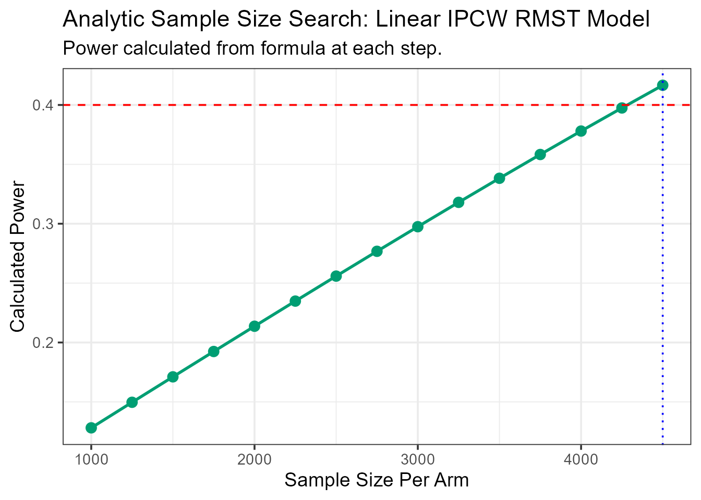

### Bootstrap Methods

Passing `type = "boot"` to
[`rmst.power()`](https://uthsc-zhang.github.io/RMSTpowerBoost-Package/reference/rmst.power.md)
or
[`rmst.ss()`](https://uthsc-zhang.github.io/RMSTpowerBoost-Package/reference/rmst.ss.md)
switches to a simulation-based approach. This method repeatedly
resamples from the reference data, fits the model on each sample, and
calculates power as the proportion of simulations where the treatment
effect is significant. It relies less on closed-form large-sample
approximations at the cost of greater computation time.

#### Power and Sample Size Calculation (bootstrap)

Here is how you would call the bootstrap method for power for the linear
model. The following examples use the same `veteran` dataset, but with a
smaller number of simulations for demonstration purposes. In practice, a
larger number of simulations (e.g., 1,000 or more) is recommended to
ensure stable results.

First we calculate the power for a range of sample sizes.

``` r
power_boot_vet <- rmst.power(
  Surv(time, status) ~ karno,
  data         = vet,
  arm          = "arm",
  sample_sizes = c(150, 200, 250),
  L            = 365,
  type         = "boot",
  n_sim        = 50
)
--- Calculating Power (Method: Linear RMST with IPCW) ---
Simulating for n = 150 per arm...
Simulating for n = 200 per arm...
Simulating for n = 250 per arm...

--- Simulation Summary ---


Table: Estimated Treatment Effect (RMST Difference)

|Statistic            |      Value|
|:--------------------|----------:|
|Mean RMST Difference |  -3.366849|
|Mean Standard Error  |   9.092000|
|95% CI Lower         | -21.050205|
|95% CI Upper         |  14.316506|
```

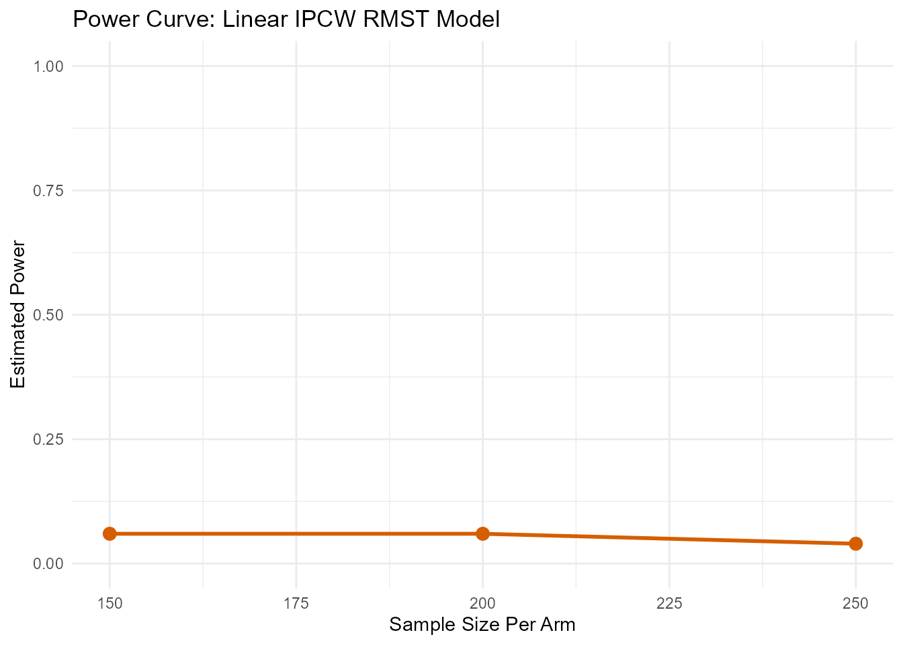

Here is how you would call the bootstrap method for sample size
calculation, targeting 50% power and truncating at 180 days (6 months).

``` r
ss_boot_vet <- rmst.ss(
  Surv(time, status) ~ karno,
  data         = vet,
  arm          = "arm",
  target_power = 0.5,
  L            = 180,
  type         = "boot",
  n_sim        = 100,
  patience     = 5
)
--- Searching for Sample Size (Method: Linear RMST with IPCW) ---

--- Searching for N for 50% Power ---
  N = 50/arm, Calculated Power = 0.27
  N = 75/arm, Calculated Power = 0.22
  N = 100/arm, Calculated Power = 0.4
  N = 125/arm, Calculated Power = 0.44
  N = 150/arm, Calculated Power = 0.41
  N = 175/arm, Calculated Power = 0.51

--- Simulation Summary ---


Table: Estimated Treatment Effect (RMST Difference)

|Statistic            |       Value|
|:--------------------|-----------:|
|Mean RMST Difference | -11.3968671|
|Mean Standard Error  |   5.8217038|
|95% CI Lower         | -22.6513793|
|95% CI Upper         |  -0.1423548|
```

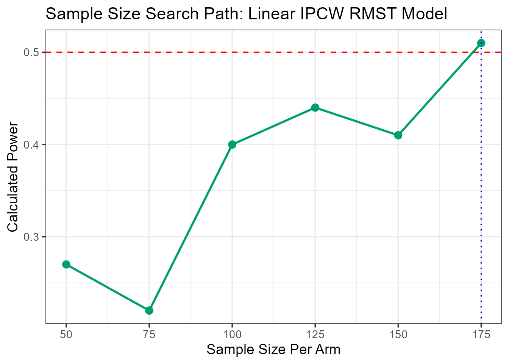

------------------------------------------------------------------------

## Additive Stratified Models

In multi-center clinical trials, the analysis is often stratified by a
categorical variable with many levels, such as clinical center or a
discretized biomarker. Estimating a separate parameter for each stratum
can be inefficient when the number of strata is large. The additive
stratified model removes the stratum-specific effects through
conditioning.

### Theory and Model

The semiparametric additive model for RMST, as developed by ([Zhang and
Schaubel 2024](#ref-zhang2024)), is defined as:
``` math
\mu_{ij} = \mu_{0j} + \beta'Z_i
```
This model assumes that the effect of the covariates $`Z_i`$ (which
includes the treatment arm) is **additive** and constant across all
strata $`j`$. Each stratum has its own baseline RMST, denoted by
$`\mu_{0j}`$.

The common treatment effect, $`\beta`$, is estimated with a
**stratum-centering** approach applied to IPCW-weighted data. This
avoids direct estimation of the many $`\mu_{0j}`$ parameters.

### Analytical Methods

#### Sample Size Calculation

**Scenario**: We use the `colon` dataset to design a trial stratified by
the extent of local disease (`extent`), a factor with 4 levels. We want
to find the sample size per stratum to achieve 60% power. Let’s inspect
the prepared `colon` dataset.

       time status      rx extent arm strata
    1  1521      1 Lev+5FU      3   1      3
    3  3087      0 Lev+5FU      3   1      3
    5   963      1     Obs      2   0      2
    7   293      1 Lev+5FU      3   1      3
    9   659      1     Obs      3   0      3
    11 1767      1 Lev+5FU      3   1      3

Now, we run the sample size search for 60% power, truncating at 5 years
(1825 days).

``` r
ss_results_colon <- rmst.ss(
  Surv(time, status) ~ 1,
  data         = colon_death,
  arm          = "arm",
  strata       = "strata",
  strata_type  = "additive",
  target_power = 0.60,
  L            = 1825,
  n_start = 100, n_step = 100, max_n = 10000
)
--- Estimating parameters from pilot data for analytic search... ---
--- Searching for Sample Size (Method: Additive Analytic) ---
  N = 100/stratum, Calculated Power = 0.069
  N = 200/stratum, Calculated Power = 0.099
  N = 300/stratum, Calculated Power = 0.128
  N = 400/stratum, Calculated Power = 0.157
  N = 500/stratum, Calculated Power = 0.186
  N = 600/stratum, Calculated Power = 0.214
  N = 700/stratum, Calculated Power = 0.243
  N = 800/stratum, Calculated Power = 0.271
  N = 900/stratum, Calculated Power = 0.299
  N = 1000/stratum, Calculated Power = 0.326
  N = 1100/stratum, Calculated Power = 0.353
  N = 1200/stratum, Calculated Power = 0.379
  N = 1300/stratum, Calculated Power = 0.405
  N = 1400/stratum, Calculated Power = 0.431
  N = 1500/stratum, Calculated Power = 0.455
  N = 1600/stratum, Calculated Power = 0.479
  N = 1700/stratum, Calculated Power = 0.503
  N = 1800/stratum, Calculated Power = 0.526
  N = 1900/stratum, Calculated Power = 0.548
  N = 2000/stratum, Calculated Power = 0.569
  N = 2100/stratum, Calculated Power = 0.59
  N = 2200/stratum, Calculated Power = 0.609

--- Calculation Summary ---


Table: Required Sample Size

| Target_Power| Required_N_per_Stratum|
|------------:|----------------------:|
|          0.6|                   2200|
```

|     | Statistic                            |     Value |
|:----|:-------------------------------------|----------:|
| arm | Assumed RMST Difference (from pilot) | -36.77351 |

Estimated Effect from Reference Data {.table .table .table-striped
style="width: auto !important; margin-left: auto; margin-right: auto;"}

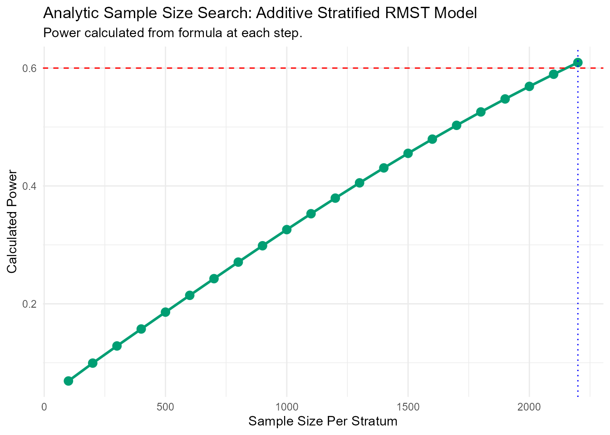

#### Power Calculation

This example calculates the power for a given set of sample sizes in a
stratified additive model using the same `colon` dataset.

``` r
power_results_colon <- rmst.power(
  Surv(time, status) ~ 1,
  data         = colon_death,
  arm          = "arm",
  strata       = "strata",
  strata_type  = "additive",
  sample_sizes = c(1000, 3000, 5000),
  L            = 1825
)
--- Estimating parameters from pilot data... ---
--- Estimating additive effect via stratum-centering... ---
--- Calculating asymptotic variance... ---
--- Calculating power for specified sample sizes... ---
```

| N_per_Stratum |     Power |
|--------------:|----------:|
|          1000 | 0.3258947 |
|          3000 | 0.7431725 |
|          5000 | 0.9212546 |

Power for Additive Stratified Colon Trial {.table .table .table-striped
style="width: auto !important; margin-left: auto; margin-right: auto;"}

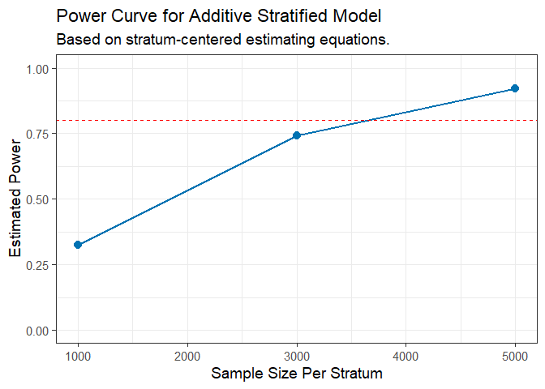

------------------------------------------------------------------------

## Multiplicative Stratified Models

Use the multiplicative model when treatment is expected to act on the
RMST scale through a relative effect, such as a percentage increase or
decrease in survival time.

### Theory and Model

The multiplicative model, based on the work of ([Wang et al.
2019](#ref-wang2019)), is defined as:
``` math
\mu_{ij} = \mu_{0j} \exp(\beta'Z_i)
```
In this model, the covariates $`Z_i`$ have a **multiplicative** effect
on the baseline stratum-specific RMST, $`\mu_{0j}`$. This structure is
equivalent to a linear model on the log-RMST.

Formal estimation of $`\beta`$ requires an iterative solver. This
package instead fits a weighted log-linear model
(`lm(log(Y_rmst) ~ ...)`) to approximate the log-RMST ratio and its
variance.

### Analytical Methods

#### Power Calculation

This function calculates the power for various sample sizes using the
analytical method for the multiplicative stratified model.

``` r
power_ms_analytical <- rmst.power(
  Surv(time, status) ~ 1,
  data         = colon_death,
  arm          = "arm",
  strata       = "strata",
  strata_type  = "multiplicative",
  sample_sizes = c(300, 400, 500),
  L            = 1825
)
--- Estimating parameters from pilot data (log-linear approximation)... ---
--- Calculating power for specified sample sizes... ---
```

| N_per_Stratum |     Power |
|--------------:|----------:|
|           300 | 0.5061656 |
|           400 | 0.6259153 |
|           500 | 0.7225024 |

Power for Multiplicative Stratified Model {.table .table .table-striped
style="width: auto !important; margin-left: auto; margin-right: auto;"}

#### Sample Size Calculation

The following example demonstrates the sample size calculation for the
multiplicative model.

``` r
ms_ss_results_colon <- rmst.ss(
  Surv(time, status) ~ 1,
  data         = colon_death,
  arm          = "arm",
  strata       = "strata",
  strata_type  = "multiplicative",
  target_power = 0.6,
  L            = 1825
)
--- Estimating parameters from pilot data (log-linear approximation)... ---
--- Searching for Sample Size (Method: Analytic/Approximation) ---
  N = 50/stratum, Calculated Power = 0.124
  N = 75/stratum, Calculated Power = 0.165
  N = 100/stratum, Calculated Power = 0.206
  N = 125/stratum, Calculated Power = 0.247
  N = 150/stratum, Calculated Power = 0.287
  N = 175/stratum, Calculated Power = 0.326
  N = 200/stratum, Calculated Power = 0.364
  N = 225/stratum, Calculated Power = 0.402
  N = 250/stratum, Calculated Power = 0.438
  N = 275/stratum, Calculated Power = 0.473
  N = 300/stratum, Calculated Power = 0.506
  N = 325/stratum, Calculated Power = 0.538
  N = 350/stratum, Calculated Power = 0.569
  N = 375/stratum, Calculated Power = 0.598
  N = 400/stratum, Calculated Power = 0.626

--- Calculation Summary ---


Table: Required Sample Size

| Target_Power| Required_N_per_Stratum|
|------------:|----------------------:|
|          0.6|                    400|
```

| Statistic                            |      Value |
|:-------------------------------------|-----------:|
| Assumed log(RMST Ratio) (from pilot) | -0.0898114 |

Sample Size for Multiplicative Stratified Model {.table .table
.table-striped
style="width: auto !important; margin-left: auto; margin-right: auto;"}

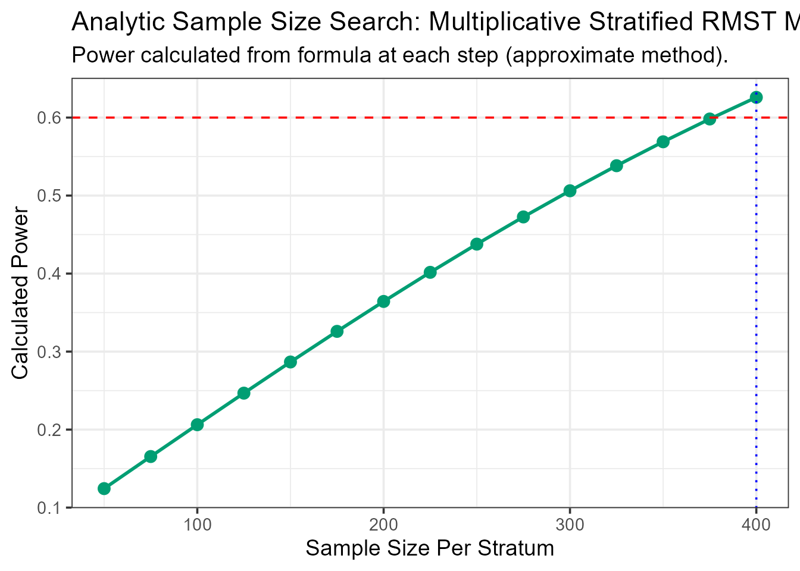

### Bootstrap Methods

The bootstrap approach provides a simulation-based analysis for the
multiplicative model. Pass `type = "boot"` together with
`strata_type = "multiplicative"`.

#### Power Calculation (bootstrap)

``` r
power_ms_boot <- rmst.power(
  Surv(time, status) ~ 1,
  data           = colon_death,
  arm            = "arm",
  strata         = "strata",
  strata_type    = "multiplicative",
  sample_sizes   = c(100, 300, 500),
  L              = 1825,
  type           = "boot",
  n_sim          = 30,
  parallel.cores = 1
)
--- Calculating Power (Method: Multiplicative Stratified RMST Model) ---
Simulating for n = 100/stratum...
Simulating for n = 300/stratum...
Simulating for n = 500/stratum...

--- Simulation Summary ---


Table: Estimated Treatment Effect (RMST Ratio)

|      |Statistic       |     Value|
|:-----|:---------------|---------:|
|      |Mean RMST Ratio | 1.0077347|
|2.5%  |95% CI Lower    | 0.9565007|
|97.5% |95% CI Upper    | 1.0564916|
```

|       | Statistic       |     Value |
|:------|:----------------|----------:|
|       | Mean RMST Ratio | 1.0077347 |
| 2.5%  | 95% CI Lower    | 0.9565007 |
| 97.5% | 95% CI Upper    | 1.0564916 |

Power for Multiplicative Stratified Model (Bootstrap) {.table .table
.table-striped
style="width: auto !important; margin-left: auto; margin-right: auto;"}

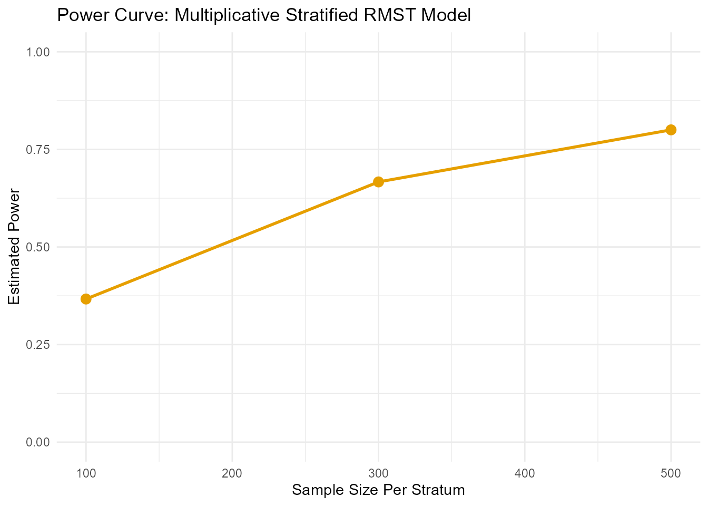

#### Sample Size Calculation (bootstrap)

``` r
ss_ms_boot <- rmst.ss(
  Surv(time, status) ~ 1,
  data           = colon_death,
  arm            = "arm",
  strata         = "strata",
  strata_type    = "multiplicative",
  target_power   = 0.75,
  L              = 1825,
  type           = "boot",
  n_sim          = 30,
  n_start        = 100,
  n_step         = 50,
  patience       = 4,
  parallel.cores = 1
)
--- Searching for Sample Size (Method: Multiplicative Stratified RMST Model) ---
  N = 100/stratum, Calculating Power... Power = 0.433
  N = 150/stratum, Calculating Power... Power = 0.733
  N = 200/stratum, Calculating Power... Power = 0.6
  N = 250/stratum, Calculating Power... Power = 0.6
  N = 300/stratum, Calculating Power... Power = 0.733
  N = 350/stratum, Calculating Power... Power = 0.8

--- Simulation Summary ---


Table: Estimated Treatment Effect (RMST Ratio)

|      |Statistic       |     Value|
|:-----|:---------------|---------:|
|      |Mean RMST Ratio | 1.0081233|
|2.5%  |95% CI Lower    | 0.9484436|
|97.5% |95% CI Upper    | 1.0621978|
```

|       | Statistic       |     Value |
|:------|:----------------|----------:|
|       | Mean RMST Ratio | 1.0081233 |
| 2.5%  | 95% CI Lower    | 0.9484436 |
| 97.5% | 95% CI Upper    | 1.0621978 |

Sample Size for Multiplicative Stratified Model (Bootstrap) {.table
.table .table-striped
style="width: auto !important; margin-left: auto; margin-right: auto;"}

------------------------------------------------------------------------

## Semiparametric GAM Models

When a covariate is expected to have a non-linear effect on the outcome,
standard linear models may be misspecified. Generalized Additive Models
(GAMs) handle this by fitting smooth functions.

### Theory and Model

These functions use a bootstrap simulation approach combined with a GAM.
The method involves two main steps:

1.  **Jackknife Pseudo-Observations**: The time-to-event outcome is
    first converted into **jackknife pseudo-observations** for the RMST.
    This technique ([Andersen et al. 2004](#ref-andersen2004); [Parner
    and Andersen 2010](#ref-parner2010)) creates a continuous,
    uncensored variable that represents each subject’s contribution to
    the RMST. This makes the outcome suitable for use in a standard
    regression framework.

2.  **GAM Fitting**: A GAM is then fitted to these pseudo-observations.
    The model has the form:
    ``` math
    \mathbb{E}[\text{pseudo}_i] = \beta_0 + \beta_{\text{effect}} \cdot \text{Treatment}_i + \sum_{k=1}^{q} f_k(\text{Covariate}_{ik})
    ```
    Here, $`f_k()`$ are the non-linear **smooth functions** (splines)
    that the GAM estimates from the data.

#### Power Calculation Formula

Because this is a bootstrap method, power is not calculated from a
direct formula but is instead estimated empirically from the
simulations:
``` math
\text{Power} = \frac{1}{B} \sum_{b=1}^{B} \mathbb{I}(p_b < \alpha)
```
Where:

- $`B`$ is the total number of bootstrap simulations (`n_sim`).

- $`p_b`$ is the p-value for the treatment effect in the $`b`$-th
  simulation.

- $`\mathbb{I}(\cdot)`$ is the indicator function, which is 1 if the
  condition is true and 0 otherwise.

### Bootstrap Methods

Wrap smooth covariates in `s()` in the formula — this automatically
routes to the GAM bootstrap engine regardless of the `type` argument.

#### Power Calculation

**Scenario**: We use the `gbsg` (German Breast Cancer Study Group)
dataset, suspecting that the progesterone receptor count (`pgr`) has a
non-linear effect on recurrence-free survival. Here is a look at the
prepared `gbsg` data.

       pid age meno size grade nodes pgr er hormon rfstime status arm
    1  132  49    0   18     2     2   0  0      0    1838      0   1
    2 1575  55    1   20     3    16   0  0      0     403      1   1
    3 1140  56    1   40     3     3   0  0      0    1603      0   1
    4  769  45    0   25     3     1   0  4      0     177      0   1
    5  130  65    1   30     2     5   0 36      1    1855      0   1
    6 1642  48    0   52     2    11   0  0      0     842      1   1

The following code shows how to calculate power. Wrapping `pgr` in `s()`
signals a smooth non-linear effect.

``` r
power_gam <- rmst.power(
  Surv(rfstime, status) ~ s(pgr),
  data           = gbsg_prepared,
  arm            = "arm",
  sample_sizes   = c(50, 200, 400),
  L              = 2825,
  n_sim          = 50,
  parallel.cores = 1
)
--- Calculating Power (Method: Additive GAM for RMST) ---
Simulating for n = 50 /arm ...
Simulating for n = 200 /arm ...
Simulating for n = 400 /arm ...

--- Simulation Summary ---


Table: Estimated Treatment Effect (RMST Difference)

|Statistic            |     Value|
|:--------------------|---------:|
|Mean RMST Difference | 861.63937|
|Mean Standard Error  |  30.11951|
|95% CI Lower         | 801.70580|
|95% CI Upper         | 921.57293|

print(power_gam$results_plot)
```

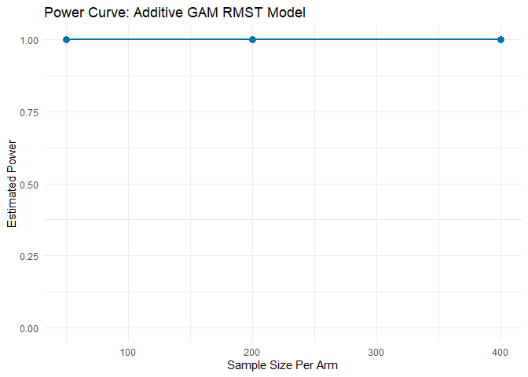

#### Sample Size Calculation

**Scenario**: We want to find the sample size needed to achieve 95%
power for detecting an effect of `pgr` on recurrence-free survival.

``` r
ss_gam <- rmst.ss(
  Surv(rfstime, status) ~ s(pgr),
  data           = gbsg_prepared,
  arm            = "arm",
  target_power   = 0.95,
  L              = 182,
  n_sim          = 50,
  patience       = 5,
  parallel.cores = 1
)
--- Searching for Sample Size (Method: Additive GAM for RMST) ---
  N = 50/arm, Calculating Power... Power = 1

--- Simulation Summary ---


Table: Estimated Treatment Effect (RMST Difference)

|Statistic            |     Value|
|:--------------------|---------:|
|Mean RMST Difference | 90.790843|
|Mean Standard Error  |  0.193416|
|95% CI Lower         | 90.111979|
|95% CI Upper         | 91.469708|
```

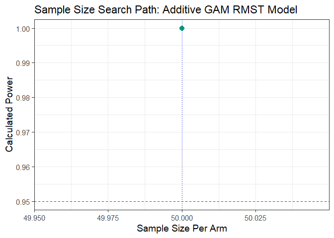

------------------------------------------------------------------------

## Covariate-Dependent Censoring Models

In many observational or longitudinal studies, the probability of being
censored may depend on measured subject characteristics such as age,
disease stage, or biomarker level, but **not** on the unobserved event
time after conditioning on those covariates. This setting is referred to
as **covariate-dependent (or conditionally independent) censoring**.
Inverse-probability-of-censoring weighting (IPCW) can account for this
dependence under the stated model and support valid estimation of the
restricted mean survival time (RMST).

### Theory and Model

We assume a single censoring mechanism described by a Cox
proportional-hazards model for the censoring time:
``` math
\text{Pr}(C \le t \mid X) = 1 - G(t \mid X),
\qquad
G(t \mid X) = \exp\{-\Lambda_C(t \mid X)\},
```
where $`X`$ denotes the observed covariates (e.g., age, sex, treatment
arm). Each subject receives an inverse-probability weight
``` math
W_i = \frac{1}{\widehat{G}(Y_i \mid X_i)},
\qquad
Y_i = \min(T_i, L),
```
with $`T_i`$ the event time and $`L`$ the truncation horizon for RMST.
Weights are stabilized and truncated to prevent numerical instability.
The weighted regression
``` math
E[Y_i \mid A_i, X_i] = \beta_0 + \beta_A A_i + X_i^\top\beta_X
```
is then fitted using weighted least squares. The variance of
$`\hat\beta_A`$ is estimated with a sandwich-type estimator that treats
the censoring model as known.

#### Power Calculation Formula

Analytic power is computed as
``` math
\text{Power}
= \Phi\!\left(
  \frac{|\hat\beta_A|}{\sigma_N}
  - z_{1-\alpha/2}
\right),
\qquad
\sigma_N^2 = \frac{\widehat{\mathrm{Var}}(\hat\beta_A)}{N},
```
where $`\widehat{\mathrm{Var}}(\hat\beta_A)`$ is the asymptotic variance
estimated from the reference data and $`N`$ is the total sample size.
Because the same IPCW model is used for all subjects, no cause-specific
components appear in the variance.

### Analytical Methods

We demonstrate this approach using the `mgus2` dataset, modeling
censoring as a function of age and sex under a single censoring
mechanism.

      id age sex dxyr  hgb creat mspike ptime pstat time death status arm
    1  1  88   F 1981 13.1   1.3    0.5    30     0   30     1      0   0
    2  2  78   F 1968 11.5   1.2    2.0    25     0   25     1      0   0
    3  3  94   M 1980 10.5   1.5    2.6    46     0   46     1      0   1
    4  4  68   M 1977 15.2   1.2    1.2    92     0   92     1      0   1
    5  5  90   F 1973 10.7   0.8    1.0     8     0    8     1      0   0
    6  6  90   M 1990 12.9   1.0    0.5     4     0    4     1      0   1

#### Power Calculation

Setting `dep_cens = TRUE` routes the call to the dependent-censoring
adjusted estimator.

``` r

dc_power_results <- rmst.power(
  Surv(time, status) ~ age,
  data         = mgus_prepared,
  arm          = "arm",
  sample_sizes = c(100, 250, 500),
  L            = 120,
  dep_cens     = TRUE,
  alpha        = 0.05
)
```

|     | Statistic                            |     Value |
|:----|:-------------------------------------|----------:|
| arm | Assumed RMST Difference (from pilot) | -10.61349 |

Analytic Power Analysis under Covariate-Dependent Censoring {.table
.table .table-striped
style="width: auto !important; margin-left: auto; margin-right: auto;"}

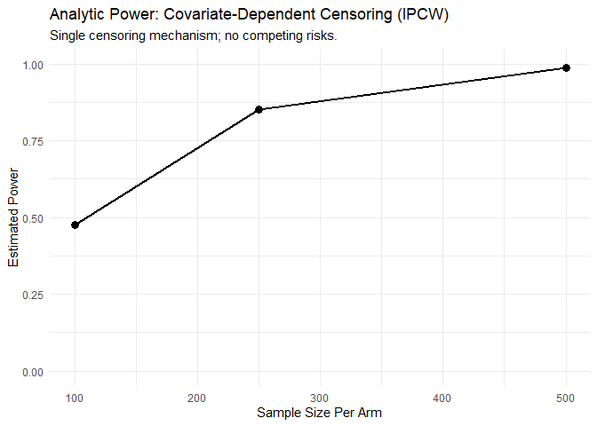

#### Sample-Size Calculation

We next estimate the per-arm sample size required to achieve 80% power
at the same truncation time (10 years).

``` r
ss_dc_mgus <- rmst.ss(
  Surv(time, status) ~ age,
  data         = mgus_prepared,
  arm          = "arm",
  target_power = 0.80,
  L            = 120,
  dep_cens     = TRUE,
  alpha        = 0.05,
  n_start = 100, n_step = 50, max_n = 5000
)

--- Calculation Summary ---


Table: Required Sample Size

| Target_Power| Required_N_per_Arm|
|------------:|------------------:|
|          0.8|                250|
```

|     | Statistic                            |     Value |
|:----|:-------------------------------------|----------:|
| arm | Assumed RMST Difference (from pilot) | -10.61349 |

Estimated RMST Difference from Reference Data {.table .table
.table-striped
style="width: auto !important; margin-left: auto; margin-right: auto;"}

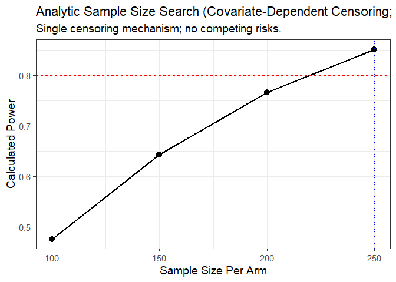

------------------------------------------------------------------------

## Interactive Shiny Application

`RMSTpowerBoost` also includes a Shiny web application for users who
prefer a graphical interface.

#### Accessing the Application

There are two ways to access the application:

1.  **Live Web Version**: Access the application directly in your
    browser without any installation.

    - [Launch Web Application](https://arnab96.shinyapps.io/uthsc-app/)

2.  **Run Locally from the R Package**: If you have installed the
    `RMSTpowerBoost-Package`, you can run the application on your own
    machine with the following command:

``` r

RMSTpowerBoost::run_app()
```

#### App Features

- Upload a reference dataset or generate data inside the app.
- Map input columns to the variables required for the analysis.
- Select the RMST model, calculation method, and analysis parameters.
- Review data summaries, Kaplan-Meier plots, result tables, and power
  curves.
- Export the analysis as PDF or HTML.

## Conclusion

`RMSTpowerBoost` centers its interface on
[`rmst.power()`](https://uthsc-zhang.github.io/RMSTpowerBoost-Package/reference/rmst.power.md)
and
[`rmst.ss()`](https://uthsc-zhang.github.io/RMSTpowerBoost-Package/reference/rmst.ss.md)
for RMST-based power and sample size calculations under linear,
stratified, semiparametric, and covariate-dependent censoring models.
Both functions use the familiar `Surv(time, status) ~ covariates`
syntax, with model choice controlled by a small set of arguments
(`strata`, `strata_type`, `dep_cens`, `type`).

In practice, these procedures depend on representative reference data
because effect sizes and variance components are estimated from that
dataset. Bootstrap-based methods can also require substantial
computation.

Future development could extend simulation-based procedures for
covariate-dependent censoring and add model diagnostic tools for
assessing reference-data assumptions.

## References

Andersen, Per K., Mette G. Hansen, and John P. Klein. 2004. “Regression
Analysis of Restricted Mean Survival Time Based on Pseudo-Observations.”
*Lifetime Data Analysis* 10 (4): 335–50.
<https://doi.org/10.1007/s10985-004-4771-0>.

Parner, Erik T., and Per K. Andersen. 2010. “Regression Analysis of
Censored Data Using Pseudo-Observations.” *Stata Journal* 10 (3):
408–22. <https://doi.org/10.1177/1536867X1001000308>.

Royston, Patrick, and Mahesh KB Parmar. 2013. “Restricted Mean Survival
Time: An Alternative to the Hazard Ratio for the Design and Analysis of
Randomized Trials with a Time-to-Event Outcome.” *BMC Medical Research
Methodology* 13 (1): 1–13.

Tian, Lu, Lihui Zhao, and LJ Wei. 2014. “Predicting the Restricted Mean
Event Time with the Subject’s Baseline Covariates in Survival Analysis.”
*Biostatistics* 15 (2): 222–33.

Uno, Hajime, Brian Claggett, Lu Tian, et al. 2014. “Moving Beyond the
Hazard Ratio in Quantifying the Between-Group Difference in Survival
Analysis.” *Journal of Clinical Oncology* 32 (22): 2380.

Wang, Xin, and Douglas E Schaubel. 2018. “Modeling Restricted Mean
Survival Time Under General Censoring Mechanisms.” *Lifetime Data
Analysis* 24: 176–99.

Wang, Xin, Yingchao Zhong, Purna Mukhopadhyay, and Douglas E Schaubel.
2019. “Computationally Efficient Inference for Center Effects Based on
Restricted Mean Survival Time.” *Statistics in Medicine* 38 (27):
5133–45.

Zhang, Yuan, and Douglas E Schaubel. 2024. “Semiparametric Additive
Modeling of the Restricted Mean Survival Time.” *Biometrical Journal* 66
(6): e202200371.
